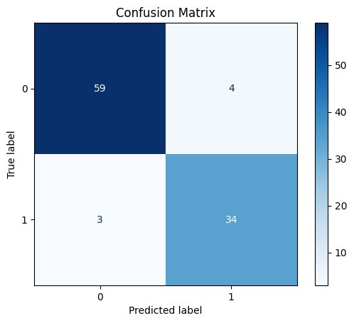
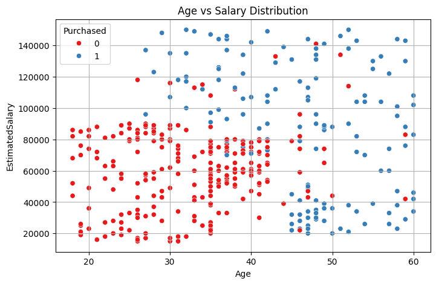

<h1 align="center">🏦 Customer Insurance Prediction</h1>

Predicting insurance purchase using Machine Learning

<h2>🚀 Overview</h2>

This project predicts whether a customer will purchase insurance based on:

<ul>
  <li><b>Age</b></li>
  <li><b>Estimated Salary</b></li>
</ul>

Instead of guessing, machine learning models are used to learn patterns and make predictions.

<h2>🎯 Goal</h2>
<ul>
  <li>Compare different classification algorithms</li>
  <li>Identify the best-performing model</li>
  <li>Understand the impact of age and salary</li>
</ul>

<h2>📊 Dataset</h2>

<table>
<tr><th>Feature</th><th>Description</th></tr>
<tr><td>Age</td><td>Customer age</td></tr>
<tr><td>EstimatedSalary</td><td>Income</td></tr>
<tr><td>Purchased</td><td>0 = No, 1 = Yes</td></tr>
</table>

✔ Missing salary values are filled using <b>median</b>

<h2>📊 Dataset Preview</h2>

<pre>
Age  EstimatedSalary  Purchased
19   19000            0
35   20000            0
26   43000            0
27   57000            0
19   76000            0
</pre>

<h2>⚙️ Workflow</h2>

<pre>
Data → Preprocessing → Scaling → Training → Evaluation → Prediction
</pre>

<ul>
  <li>Data cleaning</li>
  <li>Feature scaling (StandardScaler)</li>
  <li>Train-test split (75/25)</li>
  <li>Model training and evaluation</li>
</ul>

<h2>🤖 Models Used</h2>

<ul>
  <li>Logistic Regression</li>
  <li>KNN</li>
  <li>SVM</li>
  <li>Decision Tree</li>
  <li><b>Random Forest ⭐</b></li>
  <li>Neural Network</li>
</ul>

<h2>📈 Model Comparison</h2>

<pre>
Model                Accuracy  Precision  Recall   F1 Score
KNN                  0.93      0.894737   0.918919 0.906667
SVM                  0.93      0.857143   0.972973 0.911392
Neural Network       0.92      0.871795   0.918919 0.894737
Random Forest        0.89      0.825000   0.891892 0.857143
Logistic Regression  0.86      0.925926   0.675676 0.781250
Decision Tree        0.84      0.800000   0.756757 0.777778
</pre>

<b>Best Model:</b> KNN

<h2>📈 Evaluation Metrics</h2>

<ul>
  <li>Accuracy</li>
  <li>Precision</li>
  <li>Recall</li>
  <li>F1 Score</li>
</ul>

<b>KNN performed the best overall</b>

<h2>📋 Classification Report</h2>

<pre>
              precision    recall  f1-score   support

           0       0.95      0.94      0.94        63
           1       0.89      0.92      0.91        37

    accuracy                           0.93       100
   macro avg       0.92      0.93      0.93       100
weighted avg       0.93      0.93      0.93       100
</pre>

<h2>📉 Confusion Matrix</h2>

  

<h2>📊 Visualization</h2>

<ul>
  <li>Scatter plot of Age vs Salary</li>
  <li>Colored by purchase decision</li>
</ul>

  

<h2>🔮 Custom Predictions</h2>

<pre>
Age: 30, Salary: 87,000 → Not Purchased
Age: 40, Salary: 70,000 → Not Purchased
Age: 40, Salary: 100,000 → Purchased
Age: 50, Salary: 70,000 → Purchased
Age: 18, Salary: 70,000 → Not Purchased
Age: 22, Salary: 600,000 → Purchased
Age: 35, Salary: 2,500,000 → Purchased
Age: 60, Salary: 100,000,000 → Purchased
</pre>

<h2>🧠 Key Insights</h2>

<ul>
  <li>Salary has more influence than age</li>
  <li>Higher income → higher purchase probability</li>
  <li>Age alone is not a strong factor</li>
</ul>

<h2>📚 Learnings</h2>

<ul>
  <li>Testing multiple models is important</li>
  <li>Feature scaling improves performance</li>
  <li>Random Forest works well for structured data</li>
  <li>Visualization helps in understanding trends</li>
</ul>

<h2>🌍 Applications</h2>

<h3>Marketing</h3>
<ul>
  <li>Target potential customers</li>
  <li>Improve conversion rate</li>
</ul>

<h3>Business Strategy</h3>
<ul>
  <li>Predict customer behavior</li>
  <li>Optimize insurance plans</li>
</ul>

<h2>🛠️ Tech Stack</h2>

<ul>
  <li>Python</li>
  <li>Pandas, NumPy</li>
  <li>Scikit-learn</li>
  <li>Matplotlib, Seaborn</li>
  <li>Google Colab</li>
</ul>

<h2>🚀 Future Improvements</h2>

<ul>
  <li>Add more features</li>
  <li>Hyperparameter tuning</li>
  <li>Build a web app</li>
  <li>Auto-select best model</li>
</ul>

<h2>✅ Conclusion</h2>

This project shows how simple features like age and salary can be used to build meaningful machine learning models for prediction.

